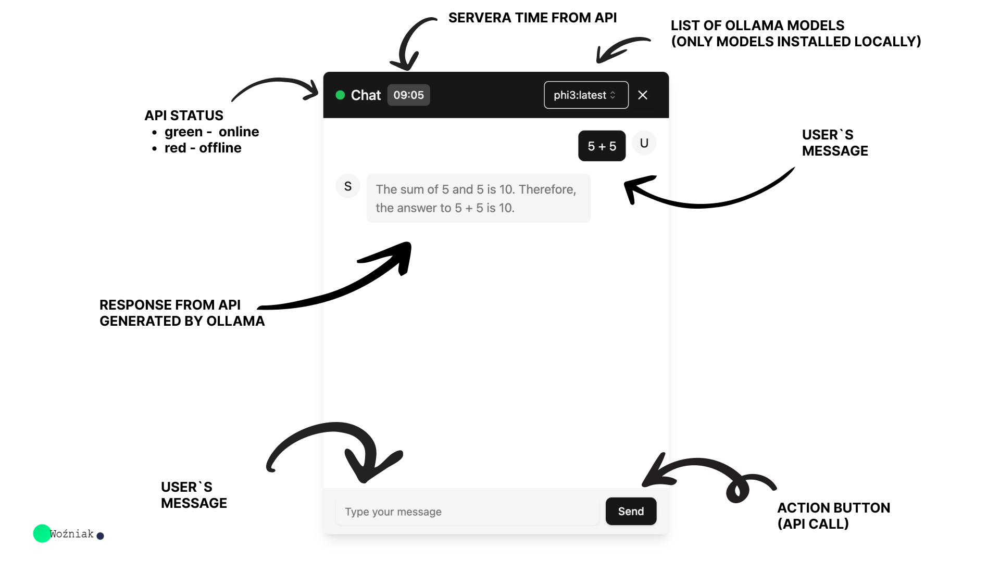
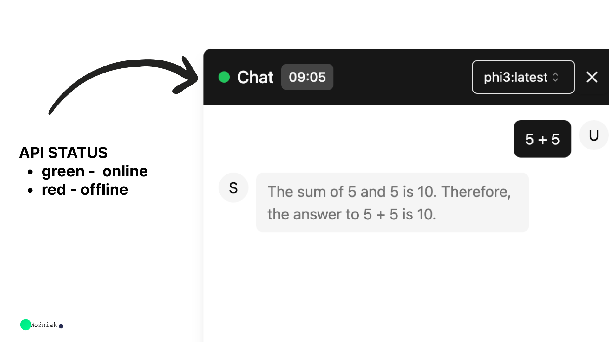
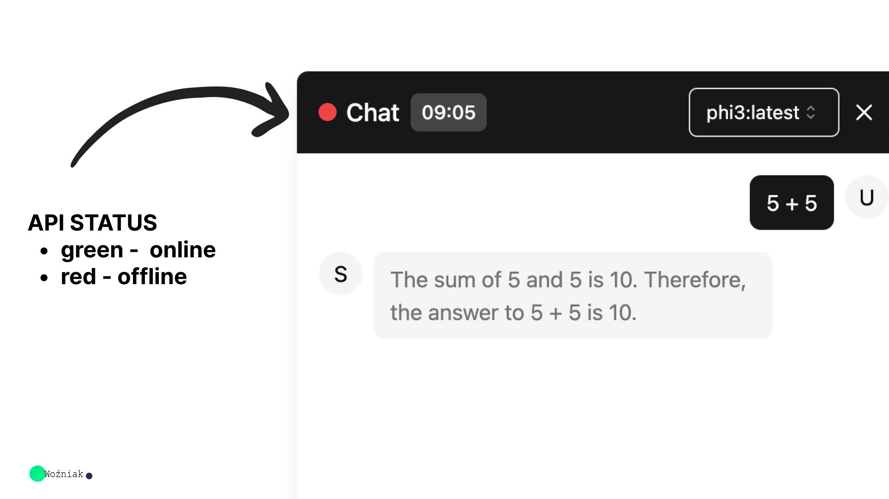
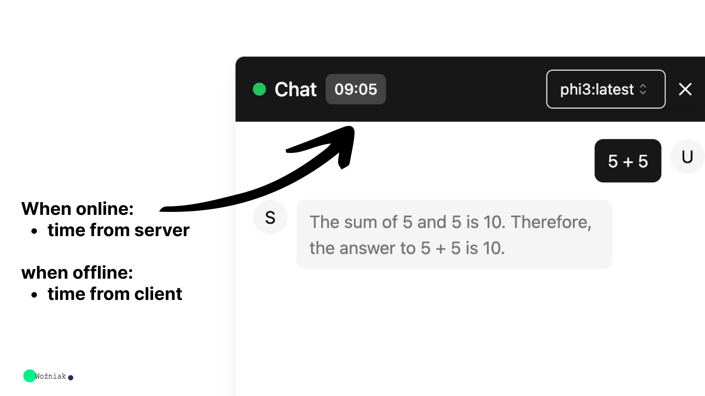
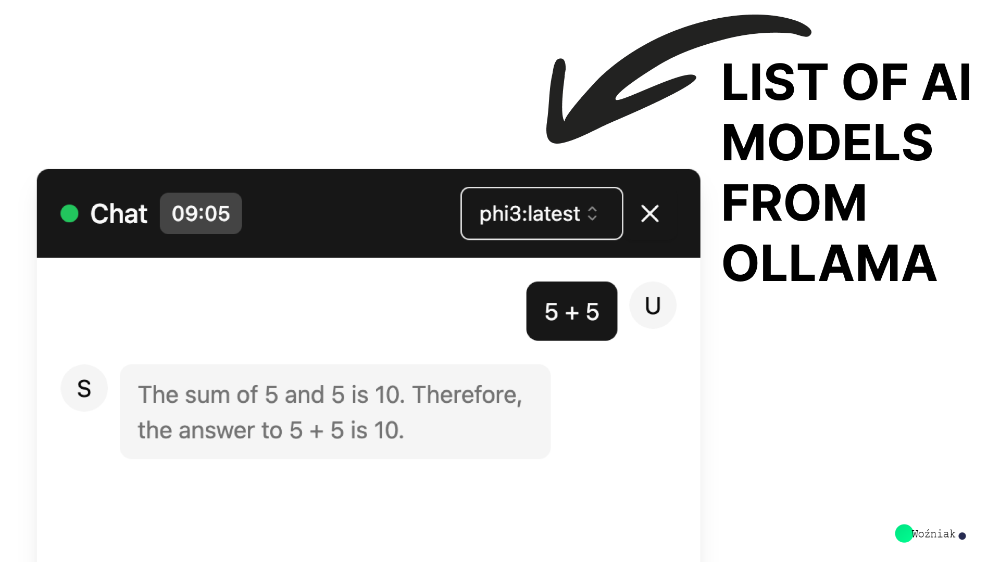
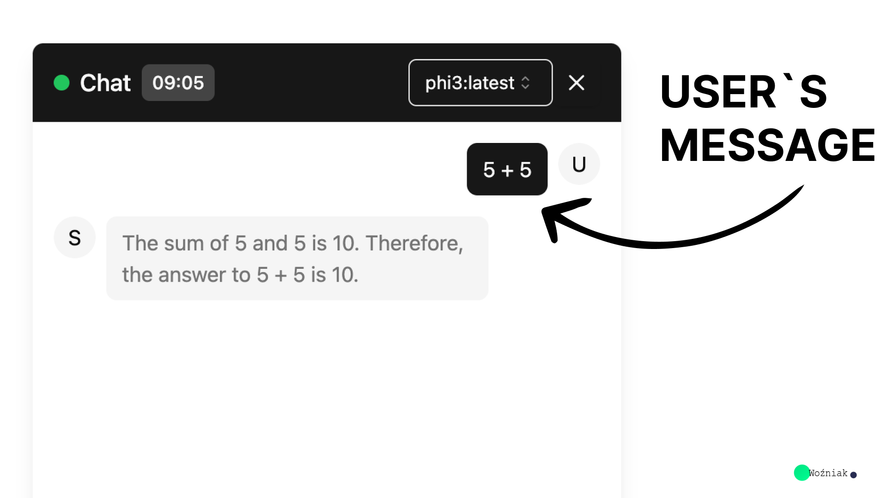
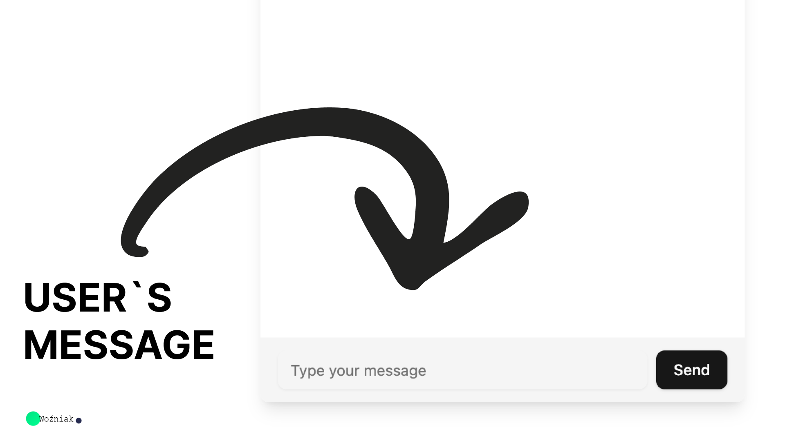
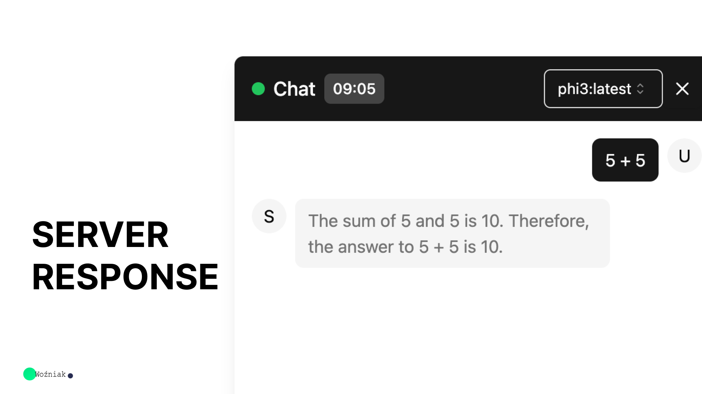

# Project Installation and Running Guide

This guide will help you to set up and run the project, which consists of two main parts: the API backend and the frontend. Follow the steps below to get everything up and running.



## Table of Contents
1. [Prerequisites](#prerequisites)
2. [Installation](#installation)
    - [API](#api-installation)
    - [Frontend](#frontend-installation)
3. [Running the Project](#running-the-project)
    - [Running the API](#running-the-api)
    - [Running the Frontend](#running-the-frontend)
4. [Project Features](#project-features)
5. [Project Structure](#project-structure)
6. [Troubleshooting](#troubleshooting)

## Prerequisites

Ensure you have the following installed on your machine:

- [Node.js](https://nodejs.org/) (v14 or higher)
- [npm](https://www.npmjs.com/) (v6 or higher) or [yarn](https://yarnpkg.com/) (optional, if you prefer using yarn)
- [Ollama](https://ollama.com)

## Installation

### API Installation
0. Download Ollama, and run it on your local machine. Download ollama models from https://ollama.com/models
    ```bash
    ollama serve
    ```

1. Navigate to the `api` directory:

    ```bash
    cd api
    ```

2. Install the dependencies:

    ```bash
    npm install
    ```

   or if you prefer yarn:

    ```bash
    yarn install
    ```

### Frontend Installation

1. Navigate to the `frontend` directory:

    ```bash
    cd ../frontend
    ```

2. Install the dependencies:

    ```bash
    npm install
    ```

   or if you prefer yarn:

    ```bash
    yarn install
    ```

## Running the Project

### Running the API

1. Navigate to the `api` directory if not already there:

    ```bash
    cd api
    ```

2. Start the API server:

    ```bash
    npm run start:dev
    ```

   or if you prefer yarn:

    ```bash
    yarn start:dev
    ```

3. The API server should now be running on [http://localhost:7010](http://localhost:7010).
4. Swagger http://localhost:7010/api

### Running the Frontend

1. Navigate to the `frontend` directory if not already there:

    ```bash
    cd ../frontend
    ```

2. Start the frontend development server:

    ```bash
    npm run dev
    ```

   or if you prefer yarn:

    ```bash
    yarn dev
    ```

3. The frontend development server should now be running on [http://localhost:5173](http://localhost:5173) or 5174.
## Project Features










## Project Structure

The project is divided into two main parts:

- **api**: Contains the backend code built with [NestJS](https://nestjs.com/).
- **frontend**: Contains the frontend code built with [Vite](https://vitejs.dev/) and [React](https://reactjs.org/).

### API Directory Structure

- `dist`: Compiled code
- `node_modules`: Dependencies
- `src`: Source code
- `test`: Test files
- `package.json`: NPM configuration file
- `tsconfig.json`: TypeScript configuration file

### Frontend Directory Structure

- `node_modules`: Dependencies
- `public`: Static assets
- `src`: Source code
- `package.json`: NPM configuration file
- `tsconfig.json`: TypeScript configuration file
- `vite.config.ts`: Vite configuration file

## Troubleshooting

If you encounter issues during installation or running the project, try the following steps:

1. Ensure all prerequisites are installed and updated.
2. Delete the `node_modules` directory and the `package-lock.json` or `yarn.lock` file, then reinstall dependencies:

    ```bash
    rm -rf node_modules package-lock.json
    npm install
    ```

   or for yarn:

    ```bash
    rm -rf node_modules yarn.lock
    yarn install
    ```

3. Check for specific error messages and consult the respective documentation for [Node.js](https://nodejs.org/), [npm](https://www.npmjs.com/), [yarn](https://yarnpkg.com/), [NestJS](https://nestjs.com/), [Vite](https://vitejs.dev/), or [React](https://reactjs.org/).

If problems persist, feel free to open an issue on the project's repository or contact the maintainers.

---
